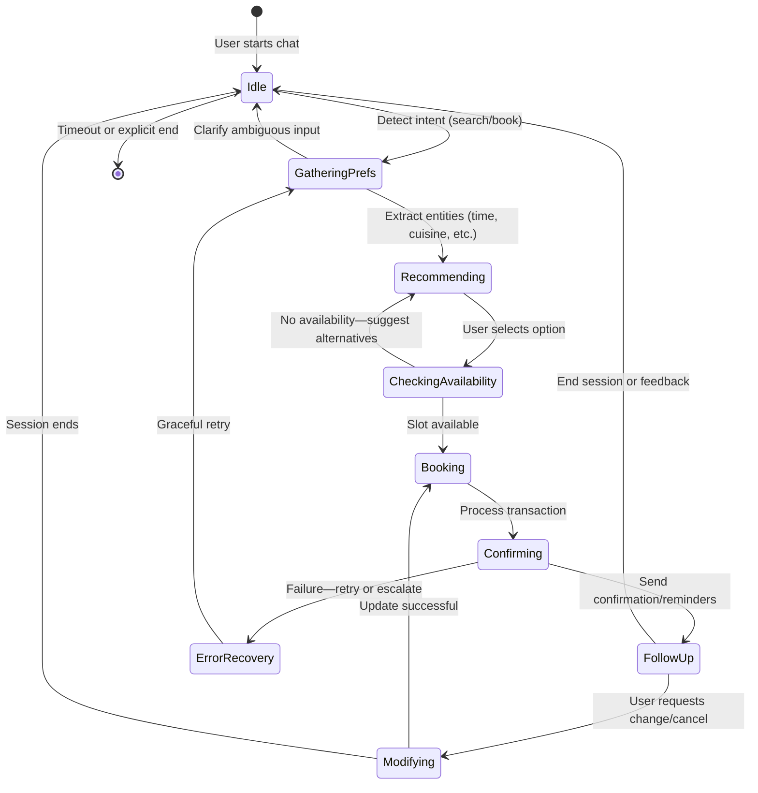

# GoodFoods AI Concierge - Use Case Template

# Goal

## Long Term Goal

Transform the restaurant reservation experience into a seamless, AI-powered conversational journey that eliminates booking friction, maximizes table utilization, and delivers hyper-personalized dining recommendations. This positions GoodFoods as the category leader in AI-driven hospitality services, expanding into adjacent verticals like spas, entertainment, and professional services, targeting a $500M+ TAM with 395%+ Year 1 ROI.

## Success Criteria

- 70%+ booking conversion rate (vs. 45% baseline)
- 4.5/5 average customer satisfaction (CSAT)
- <1% critical system downtime
- 80+ restaurants actively using the platform
- 5,000+ successful reservations in the first 6 months
- $2M ARR with 40% gross margins by 18 months
- 500 restaurant partners across 15 cities
- Validation of 2 adjacent verticals (e.g., spas and entertainment)
- Series A funding secured ($8-12M)

# Use case

GoodFoods AI Concierge is an intelligent conversational agent that assists diners in discovering, recommending, and booking restaurant tables via natural language chat. Users describe preferences (e.g., "Italian for 4 at 7 PM under $50"), and the bot handles search, availability checks, bookings, and modifications. For restaurants, it optimizes capacity by reducing no-shows (20-30% industry rate) and filling off-peak slots, saving 15-20 hours/week in staff time. This creates a two-sided marketplace with personalized upsells, dynamic pricing, and cross-location recommendations, boosting revenue by 15%+ per location while cutting customer acquisition costs from $25-50. (98 words)

## Key Steps (Bot flow)

1. **User Initiation**: User starts conversation (e.g., "Help me book dinner tonight").
2. **Intent & Preference Gathering**: Bot asks clarifying questions (e.g., cuisine, party size, budget, location) while retaining context.
3. **Recommendation & Search**: Bot suggests 3-5 matched venues with reasons (e.g., "Based on your love for sushi, try XYZ—available at 7 PM").
4. **Availability Check**: Bot verifies real-time slots and presents options.
5. **Booking Confirmation**: User selects; bot processes payment/confirmation and sends reminders.
6. **Follow-Up**: Post-booking upsell (e.g., "Add wine pairing?") or modification/cancellation if needed.
7. **Feedback Loop**: Bot solicits quick CSAT rating to refine future interactions.

## State Transition Diagram

# Bot Features

- **Key specifications that the customer cares about**:

  - Natural language understanding for multi-turn conversations (intent detection, entity extraction).
  - Hyper-personalized recommendations based on preferences, budget, and context (e.g., date night vs. family).
  - Real-time availability and conflict-free bookings.
  - Voice interface support (Google Assistant, Alexa) for hands-free use.
  - Dietary restriction handling (vegan, gluten-free, kosher).
- **KBs** (Knowledge Bases):

  - Restaurant database (80-100 seeds initially: menus, hours, features).
  - User preference profiles (anonymized patterns from past interactions).
  - Dining corpus (500K+ conversations for preference inference).
- **Does it need Tools?**:

  - Yes: Autonomous tool orchestration for function calling (e.g., search API, availability checker, booking processor, SMS/email via Twilio).
- **Which Languages**:

  - English (primary); expand to Spanish, Mandarin, French for international markets.
- **Any new features asked for?**:

  - Predictive no-show reminders to reduce losses by 30%.
  - Multi-location upselling for travelers.
  - Group booking for 20+ parties with preference conflict resolution.
- **Color Green, Yellow, Red basis difficulty**:

  | Feature                              | Difficulty | Rationale                                                       |
  | ------------------------------------ | ---------- | --------------------------------------------------------------- |
  | Intent Detection & Entity Extraction | Green      | Standard LLM capabilities (Gemini 2.5).                         |
  | Personalized Recommendations         | Yellow     | Requires preference learning models; moderate data needs.       |
  | Real-Time Inventory Management       | Yellow     | Atomic transactions and conflict prevention; integration-heavy. |
  | Voice Interface                      | Red        | Multi-modal (speech-to-text); higher latency/error risks.       |
  | International Language Support       | Red        | Cultural nuances, translation accuracy; phased rollout.         |
- **What integrations are needed**:

  - POS systems for real-time capacity (e.g., Toast, Square).
  - LLM API (Gemini 2.5) for core NLU/recommendations.
  - Twilio for SMS/email confirmations.
  - Payment gateways (Stripe) for bookings.
  - Analytics dashboard (Google Analytics/Mixpanel) for KPIs.

# Scale up / Rollout Strategy

- **Phase 1: MVP Testing (Months 1-3)**: Deploy to 5 pilot GoodFoods locations with 500 target bookings. Internal beta with staff incentives; A/B test vs. phone bookings. Gather feedback via in-bot surveys.
- **Phase 2: Internal Rollout (Months 4-6)**: Scale to all 80 GoodFoods sites. Monitor KPIs (conversion rate, CSAT) with usage quotas to control API costs. Free tier for first 100 bookings per restaurant.
- **Phase 3: External Expansion (Months 7-12)**: Onboard 200 independent restaurants via case studies and local partnerships. Regional focus (e.g., NYC, LA); dedicated success managers for adoption.
- **Phase 4: National/Vertical Growth (Months 13-24)**: Target 1,500 partners, $5M ARR. Validate adjacent verticals (spas first) with white-label APIs. Trade shows for leads; monitor ROI quarterly.

# Key Challenges

- **LLM Hallucinations & Reliability**: Medium-high risk of incorrect recommendations/bookings; mitigate with tool validation, confidence scoring, and human escalation.
- **API Cost Overruns**: High query volume (2M/year) could exceed $18K budget; address via caching, quotas, and cheaper model fallbacks.
- **Restaurant Adoption Resistance**: Operators may resist change from phone systems; counter with free trials, ROI demos, and testimonials.
- **Data Privacy & Regulatory Compliance**: Handling user profiles across sessions; ensure GDPR/CCPA/SOC 2 by Month 9.
- **Competitive Cloning**: Fast followers like OpenTable adding AI; build moat via proprietary data flywheel and restaurant relationships.

*Document Version 1.0*
*Last Updated: November 27, 2025*
*Author: GoodFoods AI Strategy Team*
